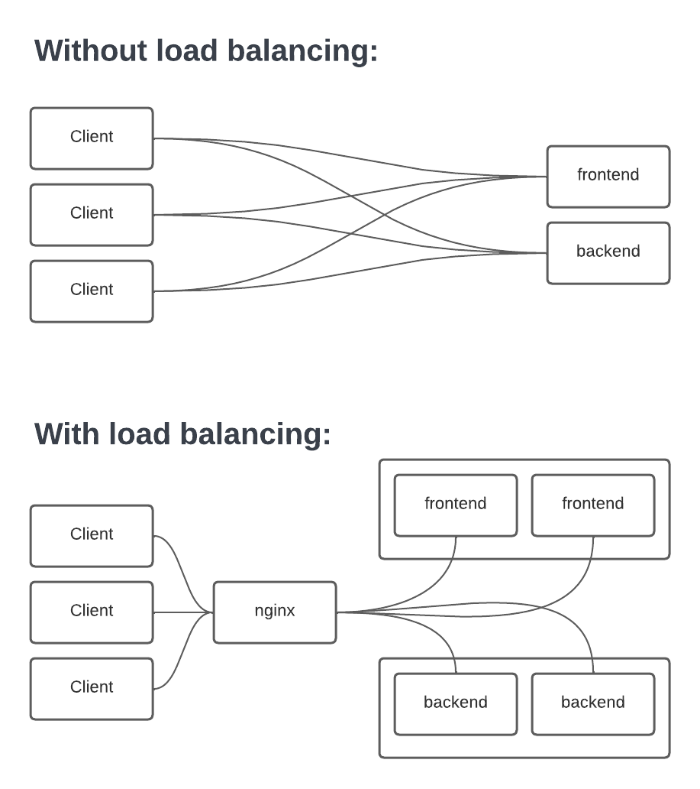

# Load Balancer

This folder contains files needed for setting up a load balancer with NGINX for a production environment. This, in concert with service scaling, allows for a more scalabale and reliant application.

---

From the root folder, the application should be run in a production environment with the following command:

```
sudo docker-compose -f docker-compose.production.yml up --build --scale backend=2 --scale frontend=2
```

**NOTE:** the above command creates 2 frontend instances and 2 backend instances. The number of instances can be modified by changing the corresponding numbers in the command.

---

